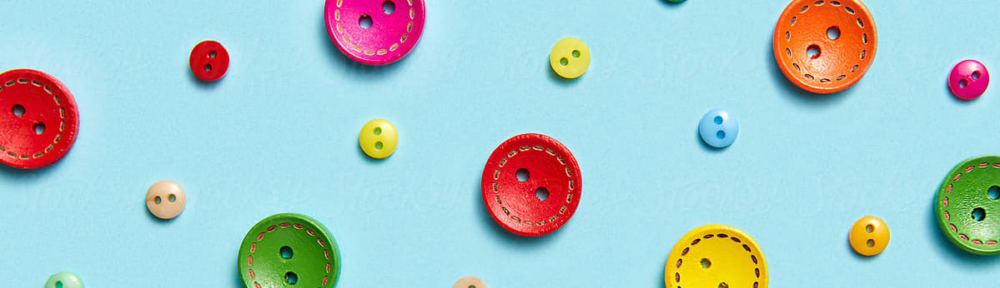
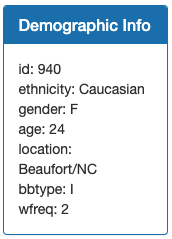
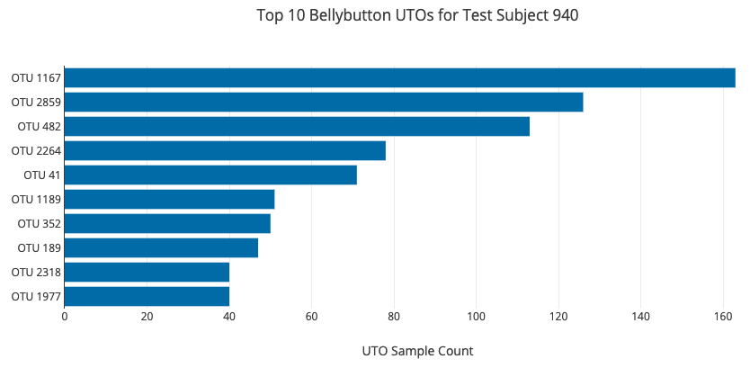
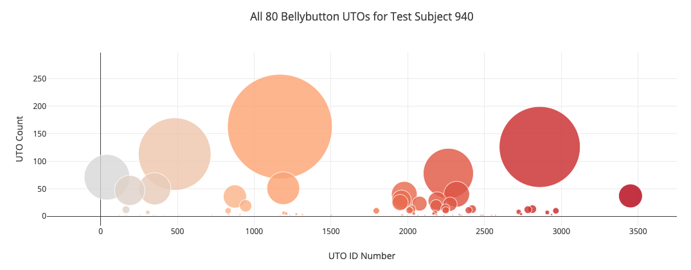
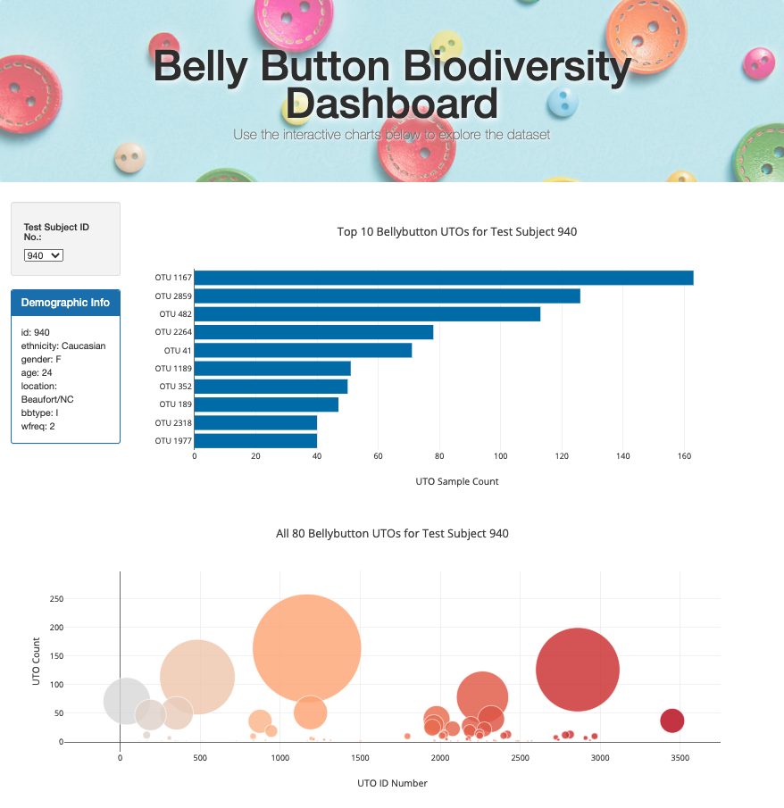

# Plot.ly Challenge - Belly Button Biodiversity

This project builds an interactive dashboard built using two Javascript libraries, Plot.ly and D3, that allows the user to explore the [Belly Button Biodiversity dataset](http://robdunnlab.com/projects/belly-button-biodiversity/).

The dataset reveals that a small handful of microbial species (also called operational taxonomic units, or OTUs, in the study) were present in more than 70% of people, while the rest were relatively rare.

The site allows users to select an ID from the dropdown menu to display information from an individual.

## Plotly

The challenge was to retrieve individual sample information from the dataset, and draw a bar chart and bubble chart to display the information. The following was done in order to create the displays:

* important variables from the html file were defined
* read samples.json with the D3 library
* retrieved metadata for each test subject and added to table, with one key-value pair for each row

* stored sample data like otu_ids, sample_values, and otu_labels as arrays for later use
  * top 10 values were stored as seperate variables for bar chart
* created plot.ly displays

### Bar Chart
The 3 arrays of top 10 OTU were sliced and reversed to display in descending order:

### Bubble Chart
The 3 arrays of *all* OTU were used to plot the bubble chart:

## Dashboard

Once the visualizations were complete, they could be implemented into the html page, forming a complete dashboard:

## Deployment

The final dashboard was deployed using GitHub Pages and can be viewed here: 
